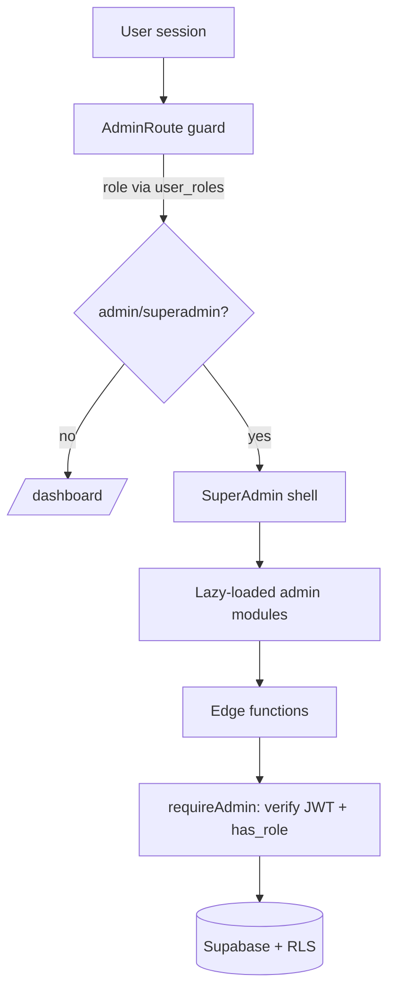

# SuperAdmin — Enterprise Hardening & Reorganization Plan

> Status: PLAN (awaiting go-ahead on Phase 1 destructive/shared-system items).
> Scope: `/superadmin` UI, admin edge functions, role/auth model, RLS, feature overlays, the standalone `superadmin-server.js`.

## 0. Executive summary

The SuperAdmin subsystem is **functionally blocked and insecure**:

- The `superadmin` role is checked in the UI but **does not exist** in the DB `app_role` enum → no one can ever pass the gate.
- The `/superadmin` route is **client-side gated only** — not protected server-side.
- A standalone [superadmin-server.js](superadmin-server.js) exposes an **unauthenticated "emergency superadmin" backdoor** on `0.0.0.0:5000`. **This must be quarantined first.**
- Several admin edge functions are empty/unwired; [DatabaseInspector.tsx](src/components/admin/DatabaseInspector.tsx) intends arbitrary SQL execution.
- Multiple RLS policies use `USING (true)` / `WITH CHECK (true)` allowing anonymous write/read.

The plan below sequences fixes by **risk-reduction first**, then correctness, then organization, then UX/performance.

## 1. Confirmed findings (verified in code)

| # | Severity | Finding | Evidence |
|---|----------|---------|----------|
| 1 | 🔴 Critical | `app_role` enum lacks `superadmin`; UI checks for it | enum: [migration](supabase/migrations/20251010051243_15b8e34e-dfdd-45e7-981d-1d6c3e819724.sql) L1; UI: [SuperAdmin.tsx](src/pages/SuperAdmin.tsx) role check |
| 2 | 🔴 Critical | `/superadmin` not wrapped in a role-guarded route | [App.tsx](src/App.tsx) L301 `<Route path="/superadmin" element={<SuperAdmin />} />` |
| 3 | 🔴 Critical | `ProtectedRoute` verifies session only, no role | [ProtectedRoute.tsx](src/components/ProtectedRoute.tsx) |
| 4 | 🔴 Critical | Unauthenticated backdoor server on `0.0.0.0`, CORS `*` | [superadmin-server.js](superadmin-server.js) L1-70 |
| 5 | 🔴 Critical | `admin-sql-exec` arbitrary SQL intent, no visible role guard | [DatabaseInspector.tsx](src/components/admin/DatabaseInspector.tsx) |
| 6 | 🟠 High | RLS `WITH CHECK (true)` / `USING (true)` on AI tables | [migration](supabase/migrations/20251017232156_7c3ddbd8-689b-4d30-bf82-ed09e56ba278.sql) |
| 7 | 🟠 High | Admin edge functions empty/unwired → runtime failures | `supabase/functions/admin-*`, several `ai-*` |
| 8 | 🟡 Medium | Orphaned/dead admin components & stubs | [ChatAdminPanel.tsx](src/components/ChatAdminPanel.tsx), [PremiumServicesAdmin.tsx](src/pages/admin/PremiumServicesAdmin.tsx) |
| 9 | 🟡 Medium | Console/debug artifacts in admin code | [SuperAdmin.tsx](src/pages/SuperAdmin.tsx) |

> Note: a few edge-function dirs flagged "empty" DO contain `index.ts` (e.g. `ai-generate-chapter`). Each will be verified individually before wiring.

## 2. Target architecture

Principles: **defense in depth** (UI gate + route guard + edge-function role check + RLS), least privilege, no service-role key on the client, server-verified entitlement, mobile-first responsive shell, lazy-loaded modules for performance.

## 3. Phased execution

### Phase 0 — Quarantine (do first, low blast radius)
- [ ] Neutralize [superadmin-server.js](superadmin-server.js): bind to `127.0.0.1`, require an auth token, or remove it from start scripts entirely. **Decision needed: keep with auth, or delete.**
- [ ] Confirm it is not referenced in `package.json` scripts / deploy config.

### Phase 1 — Role model correctness (DB migration)
- [ ] Add `superadmin` to `app_role` enum (or standardize on `admin` + a `superadmin` flag). **Decision needed.**
- [ ] Add a `has_min_role()` / `is_admin()` helper (superadmin ⊇ admin).
- [ ] Seed the intended superadmin user's role. **Decision needed: which account/email.**
- [ ] Tighten `user_roles` "Admins can manage all roles" so admins can't self-escalate to superadmin.

### Phase 2 — Server-side route & function guards
- [ ] Create `AdminRoute` guard (session + `has_role`) and wrap `/superadmin` and admin subroutes.
- [ ] Add a shared `requireAdmin(req)` helper for every admin/AI edge function; return 403 when not admin.
- [ ] Ensure `verify_jwt = true` for all admin functions in [config.toml](supabase/config.toml).

### Phase 3 — Harden data access (RLS)
- [ ] Replace `USING (true)` / `WITH CHECK (true)` on AI/admin tables with owner/admin scoped policies.
- [ ] Rate-limit / constrain client-writable `ai_error_logs` inserts.
- [ ] Audit every admin table for read-scope leakage (full user PII exposure).

### Phase 4 — Wire admin capabilities safely
- [ ] Replace `admin-sql-exec` free-form SQL with a **whitelisted, parameterized** read-only inspector (named queries only), admin-guarded.
- [ ] Implement/verify `admin-users` (create/ban) with `requireAdmin` + audit logging.
- [ ] Implement/verify AI functions (`ai-error-analyzer`, `ai-apply-fix`, `ai-deploy-fix`) with approval gating; no auto-deploy.

### Phase 5 — Feature overlays (per-feature enablement)
- [ ] Persist `premium_services` / feature flags to DB with an admin CRUD panel (replace the local-state stub).
- [ ] Central `useFeatureFlag()` hook; overlay/lock UI derived from DB, enforced by RLS/edge checks — not client-only.

### Phase 6 — Organize, clean, mobile-first & performance
- [ ] Remove dead code (`ChatAdminPanel`), consolidate duplicated admin panels.
- [ ] Strip debug `console.log`/toasts leaking IDs/roles.
- [ ] Lazy-load admin modules (`React.lazy`) + code-split the ~47 tabs; responsive nav (drawer on mobile).
- [ ] Add error boundaries per admin module.

## 4. Decisions required before Phase 0/1
1. **`superadmin-server.js`**: delete it, or keep it bound to localhost behind a token?
2. **Role model**: add `superadmin` enum value, or collapse to `admin` + a boolean super flag?
3. **Superadmin account**: which email/user id should be seeded as superadmin?
4. **Execution appetite**: do all phases now, or land Phase 0–2 (security-critical) first and iterate?

## 5. Acceptance criteria (enterprise-grade)
- Non-admins cannot reach `/superadmin` (client + server) and cannot call any admin function (403).
- No service-role key in the client bundle; no public backdoor server.
- Every admin table enforces admin/owner scope via RLS; no `USING (true)` writes from anon.
- All admin actions are audit-logged.
- SuperAdmin shell loads mobile-first, lazy-loads modules, and is free of TypeScript/build errors.
